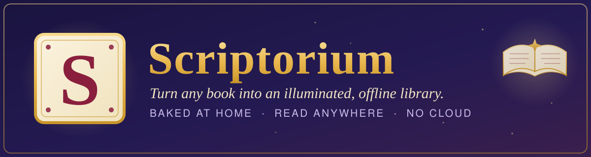
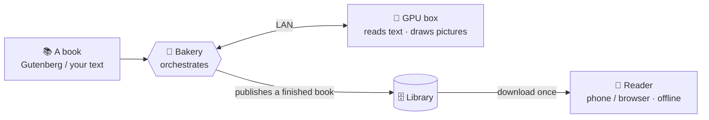

<p align="center">
  
</p>

<p align="center">
  <strong>Turn any book into an illustrated, offline-readable library — baked at home, read anywhere, no cloud.</strong>
</p>

<p align="center">
  
</p>

---

Scriptorium takes a plain book — a classic from Project Gutenberg, or your own text — and **illustrates
it with AI that runs entirely on your own machine**. It figures out who the characters are, draws them,
picks the moments worth a picture, paints those scenes in an art style you choose, and packages the
result as a tidy, self-contained book you can read on your phone or in a browser — fully offline, no
accounts, nothing sent to the cloud.

There are two halves: a **bakery** that does the illustrating (it runs at home and borrows a graphics
card for the heavy AI work), and a **reader** app that owns finished books on your device and works with
the internet switched off.

## Two ways in

| | |
|---|---|
| 📖 **I just want to read books** | Someone already runs the bakery on your home network. → **[Reading books](docs/guide/reading-books.md)** |
| 🍞 **I want to run my own bakery** | Set up the bakery + graphics card and make your own illustrated books. → **[Self-hosting guide](docs/guide/self-hosting.md)** — and **[Making a book](docs/guide/making-books.md)** for the day-to-day. |

## Highlights

- **Reads fully offline.** Once a book is on your device, everything works with no internet — pages,
  pictures, search, highlights. The reading path never phones home.
- **AI-drawn illustrations.** Scenes are painted in an art style you pick, with characters that stay
  recognizable from page to page.
- **A cast page.** Tap any character for a "Dramatis Personae" portrait and blurb — and it won't spoil
  anyone you haven't met yet.
- **Swappable art styles.** Re-illustrate the same book as a comic, a woodcut, an ukiyo-e print… and
  switch between sets while you read.
- **Highlights, notes & full-text search**, with your annotations quietly syncing to the home server
  when it's reachable.
- **100% local AI.** The language model and the image generator both run on your own hardware. No API
  keys, no subscriptions, no cloud.

## Screenshots

> Real screenshots land next pass — these are placeholders. The full capture list is in
> **[docs/SCREENSHOTS.md](docs/SCREENSHOTS.md)**.

| Reading a book | The cast page | Choosing pictures |
|:---:|:---:|:---:|
|  |  |  |

## How it works

You load a book and kick it off; the bakery does the rest and you come back to a finished, illustrated
book. Under the hood there are three pieces:

- **The bakery** (this repo) — orchestrates everything and hands finished books to readers. Runs on an
  ordinary home server.
- **The GPU box** — a machine with an NVIDIA graphics card running two small helper services: one that
  reads the text ([text-transform-service](https://github.com/kbennett2000/text-transform-service)) and
  one that draws the pictures ([imagegen-service](https://github.com/kbennett2000/imagegen-service)). The
  bakery and the GPU box can even be the same machine.
- **The reader** — the app on your phone or browser that owns books on-device and reads them offline.



Nothing here talks to the cloud: the AI models run locally on the GPU box, and the reader keeps books on
your device. See the [design doc](scriptorium-DESIGN.md) for the full picture.

## Companion projects

The bakery delegates the heavy AI work to two small services that live in their own repos:

- **[text-transform-service](https://github.com/kbennett2000/text-transform-service)** — the "text
  brain." Reads each page and returns tidy facts (who's in it, where/when it happens, what to draw). Runs
  a local language model via [Ollama](https://ollama.com).
- **[imagegen-service](https://github.com/kbennett2000/imagegen-service)** — the "picture maker." Fronts
  a local [ComfyUI](https://github.com/comfyanonymous/ComfyUI) (Stable Diffusion XL) so LAN apps can share
  one graphics card.

## Repo layout

| Path | What |
|---|---|
| `server/` | Python 3.12 / FastAPI bakery — pipeline, library, sync, and it serves the two web apps |
| `reader/` | Vite + React offline-first reader (also wrapped as an Android app via Capacitor) |
| `admin-ui/` | Vite + React admin workbench (bake wizard + review gate), served at `/admin` |
| `shared/schemas/` | JSON Schemas — the single source of truth for every file format |
| `shared/types/` | TypeScript types generated from the schemas (committed) |
| `scripts/` | One-command `setup` + `start` helpers for Windows / macOS / Linux |
| `docs/` | Guides, screenshots, and Architecture Decision Records (`docs/adr/`) |

## For developers

Prerequisites: [`uv`](https://docs.astral.sh/uv/), Node 20+, and [`just`](https://github.com/casey/just).

```sh
# server
cd server && uv sync
just server-test        # tests pass with NO GPU services running
just server-dev         # http://localhost:8720

# web apps
cd reader && npm install      # and/or: cd admin-ui && npm install
just reader-dev               # http://localhost:5173
just admin-dev                # http://localhost:5174

# whole repo
just lint-all
just test-all
```

New here? The fastest path to a running server is **[the self-hosting guide](docs/guide/self-hosting.md)**
(it wraps all of the above in two commands). Architecture lives in
[`scriptorium-DESIGN.md`](scriptorium-DESIGN.md); design decisions are recorded as ADRs under
[`docs/adr/`](docs/adr/); the phone-app build is in [`reader/BUILDING.md`](reader/BUILDING.md).

## Status & license

Active build. The reading experience and the bake pipeline both work end-to-end today.

Open source under the **[MIT License](LICENSE)** — take it, change it, build on it, sell it. Just keep
the copyright notice. © 2026 Kris Bennett.

Contributions and forks are welcome. If you build something fun with it, I'd love to hear about it.
