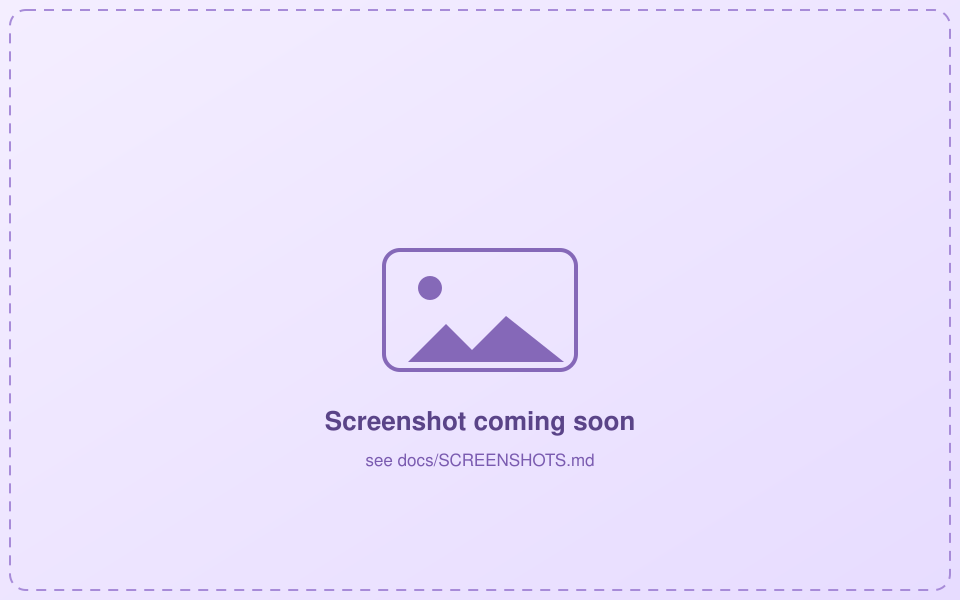

# Reading books with Scriptorium

Welcome! This guide is for **reading** the illustrated books someone has made on your home network.
No setup, no accounts, no jargon — if you can open a web page or tap an app, you can do this. 📖

Everything here works **offline**. Once a book is on your device, you can read it on a plane, in a
cabin, in the garden with the Wi-Fi off — pictures and all.

---

## Step 1 — Open Scriptorium

You have two easy ways in. Pick whichever suits you.

### The quickest way: your web browser

If the Scriptorium bakery is running on your home network, just open a browser and go to the address
someone gave you. It usually looks like this:

```
http://your-home-server:8720
```

That's it — no install. Bookmark it and you're set.

> **Where do I get that address?** From whoever set up the bakery. It's their home server's name or
> number followed by `:8720`. If a plain name doesn't work, ask them for the number version (something
> like `http://192.168.1.10:8720`).



### The cozy way: the phone app

There's an Android app so your books live right on your phone. Installing it is a one-time thing that
the person running your bakery sets up for you — the friendly details are in
[the phone-app guide](../../reader/BUILDING.md). Once it's on your phone, it behaves exactly like the
browser version below.

---

## Step 2 — Pick your profile

The first time you open Scriptorium, you'll see a row of **profiles** — one per person in the house.
Tap yours. No passwords; it just keeps everyone's books, bookmarks, and highlights separate.


You can switch profiles anytime from **Settings**.

---

## Step 3 — Get a book onto your device

You'll land on your **Shelf**. Books come in two flavors:

- **Available** — ready to download from the home server.
- **On this device** — already downloaded and ready to read offline.

Tap an available book to **download** it. You'll see a little progress bar; when it fills, the book is
yours to read anywhere, no internet needed.


> Downloading once is all it takes. After that, the book stays on your device even with the Wi-Fi off.
> Removing a book to free up space is safe — your highlights and bookmarks are kept, so you can
> re-download later and pick up right where you were.

---

## Step 4 — Read!

Open a book and read. Text flows to fit your screen, with **illustrations right where they belong** in
the story. Tap the edges (or swipe) to turn pages.


Along the toolbar you'll find a few delightful extras:

### 👤 The cast page

Tap **Cast** for the *Dramatis Personae* — a portrait and a one-line description of each character.
Handy when you're 300 pages in and thinking "wait, who's this again?"

It's spoiler-safe: you'll only see characters you've already met, never ones waiting further ahead.


### 🎨 Pictures — change the art style

Tap **Pictures** to switch the whole book's illustrations to a different style — a comic look, a
woodcut, a watercolor. Every book starts on its **Default** set, and you can even make your own.


### 🔍 Search

Tap **Search** to find any word or phrase in the book. Tap a result to jump straight to that page.


### ✍️ Highlight, note & bookmark

Select some text to **highlight** it (in a few colors), attach a **note**, or drop a **bookmark**.
Your **Annotations** panel gathers them all in one place so you can flip back to a favorite passage.


Your highlights and bookmarks quietly sync back to the home server whenever it's in reach — so if you
read on your phone and later open the same book in a browser, they'll be waiting for you.

### 🖼️ Enlarge a picture

Tap any illustration to blow it up full-screen. Tap again to close.


---

## Make it comfortable

Open **Settings** to read the way *you* like:

- **Typeface** — a classic book serif or a clean sans.
- **Font size** — five steps, from cozy to large-print.
- **Theme** — bright, warm sepia, or easy-on-the-eyes dark.
- Switch **profiles**, sync now, and check how much is stored on your device.


---

## Frequently wondered

**Do I need the internet to read?**
No. You need it once to *download* a book. After that, reading, searching, and highlighting all work
completely offline.

**Will my highlights get lost if I remove a book?**
No. Removing a book frees up space but keeps your notes and bookmarks. Re-download later and they
reappear.

**Nothing shows up on my shelf.**
The home server (the "bakery") may be off, or you may be on a different network than it. Check with
whoever runs it — that's the [self-hosting guide](self-hosting.md) side of things.

**Can I make my own books?**
Yes! That's the other half of Scriptorium. See **[Making a book](making-books.md)**.

Happy reading. 📚
