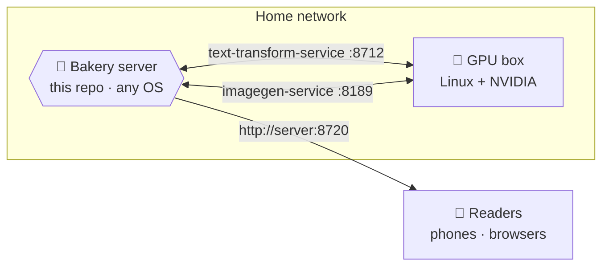

# Self-hosting Scriptorium

This guide sets up the **bakery** — the home server that makes and serves illustrated books — plus the
**GPU box** that does the AI drawing. When you're done, anyone in the house can read on their phone or
browser, and you can make books whenever you like.

It's more involved than just reading a book, but we've boiled the server down to **two commands**. Take
it a step at a time; you've got this. 🍞

---

## The shape of it

Scriptorium is two roles. They can live on **one machine or two**:

- **The bakery** (this repo) — an ordinary computer that runs the app, stores your library, and serves
  the reader + admin web pages. Runs on **Windows, macOS, or Linux**.
- **The GPU box** — a computer with an **NVIDIA graphics card** that does the heavy AI work: reading the
  text and drawing the pictures. This half realistically needs **Linux + an NVIDIA GPU**.



If you only want to *try* the bakery without a graphics card, you can — it'll run and let you click
around, and books will simply pause at "waiting for the graphics card" until the GPU box is ready.

---

## Part 1 — The bakery server

### What you'll need

| Tool | Why | Get it |
|---|---|---|
| **Python 3.12** | runs the server | <https://www.python.org/downloads/> |
| **Node 20+** | builds the two web apps | <https://nodejs.org> |
| **uv** | installs the Python bits | <https://docs.astral.sh/uv/> |
| **just** *(optional)* | handy task shortcuts | <https://github.com/casey/just> |

### Quick start (recommended)

From the project folder, run the two helper scripts. They check your tools, install everything, build
the web apps, and start the server.

**macOS / Linux:**

```bash
./scripts/setup.sh      # one time: installs + builds everything
./scripts/start.sh      # starts the server
```

**Windows (PowerShell):**

```powershell
.\scripts\setup.ps1     # one time: installs + builds everything
.\scripts\start.ps1     # starts the server
```

When it's running, open **<http://localhost:8720>** for the reader and **<http://localhost:8720/admin>**
for the bakery controls. Other devices on your network use your computer's name or IP instead of
`localhost`, e.g. `http://192.168.1.10:8720`.

> The scripts store your library in a `scriptorium-data` folder inside the project by default. To keep
> it somewhere else, set `SCRIPTORIUM_DATA` first (see [Configuration](#configuration)).
>
> *Windows note:* the `.ps1` scripts mirror the `.sh` ones step-for-step but have had less real-world
> testing than the macOS/Linux path — if anything looks off, the manual steps below are the fallback.

### Manual setup (if you'd rather do it by hand)

The scripts just run these for you:

```bash
# 1. Install the server's Python dependencies
cd server && uv sync && cd ..

# 2. Build the two web apps (so the one server can serve them)
cd reader && npm install && npm run build && cd ..
cd admin-ui && npm install && npm run build && cd ..

# 3. Start the server, pointing it at a writable data folder
SCRIPTORIUM_DATA="$PWD/scriptorium-data" \
  server/.venv/bin/uvicorn scriptorium.app:app --host 0.0.0.0 --port 8720
```

On Windows the last line is a touch different — use `scripts\start.ps1`, which handles it for you.

### Configuration

Everything is set with environment variables; all are optional and have sensible defaults, so the
server boots even with none set.

| Variable | What it does | Default |
|---|---|---|
| `SCRIPTORIUM_DATA` | Where your library, jobs, and annotations live. **Point this at a writable folder.** | `/var/lib/scriptorium` (the scripts use `./scriptorium-data` instead) |
| `SCRIPTORIUM_PORT` | Port the server listens on | `8720` |
| `TTS_URL` | Address of the text service on the GPU box | *(unset — text steps wait)* |
| `IMAGEGEN_URL` | Address of the picture service on the GPU box | *(unset — drawing waits)* |
| `AUTO_START` | Start each new book automatically, no "Start" click | `false` |
| `AUTO_APPROVE` | Approve the review step automatically | `false` |
| `GPU_WOL_ENABLED` / `GPU_MAC` | Wake a sleeping GPU box over the network | `false` / *(unset)* |
| `RUNNER_TICK_S` | How often (seconds) the bakery checks for work | `5` |
| `RENDER_BACKEND` | Where pictures are drawn: `local` (the picture service at `IMAGEGEN_URL`) or `runpod` (a Runpod serverless endpoint) | `local` |
| `RUNPOD_ENDPOINT_ID` | The Runpod endpoint id to draw on. Required when `RENDER_BACKEND=runpod` | *(unset)* |
| `RENDER_CONCURRENCY` | How many pictures to draw at once. **Ignored on `local`** — one GPU draws one picture at a time, so asking for more just makes them queue | `4` |
| `RENDER_CARD` | The GPU model you expect to draw on, e.g. `NVIDIA GeForce RTX 4090`. If a picture comes back from a different card, the log says so | *(unset — no check)* |

Set them before `start`, for example:

```bash
# macOS / Linux
export TTS_URL=http://192.168.1.20:8712
export IMAGEGEN_URL=http://192.168.1.20:8189
./scripts/start.sh
```

```powershell
# Windows
$env:TTS_URL = "http://192.168.1.20:8712"
$env:IMAGEGEN_URL = "http://192.168.1.20:8189"
.\scripts\start.ps1
```

**Drawing on rented GPUs instead of your own.** Set `RENDER_BACKEND=runpod` and point
`RUNPOD_ENDPOINT_ID` at a Runpod serverless endpoint running the render worker. Pictures are
then drawn there, several at a time, while the text steps stay on your machine. Keep
`IMAGEGEN_URL` set as well — it is still used to free your GPU's memory before each text step.

```bash
export IMAGEGEN_URL=http://192.168.1.20:8189   # still needed
export RENDER_BACKEND=runpod
export RUNPOD_ENDPOINT_ID=xxxxxxxxxxxxxx
export RENDER_CONCURRENCY=4
export RENDER_CARD="NVIDIA GeForce RTX 4090"
```

Credentials are read from `~/.runpod/config.toml`, the file `runpodctl` and `flash` already
write. There is no environment variable for the key, deliberately: an API key in an
environment variable has usually been typed into a shell history first.

Two things to know before you use it. Rented GPUs cost money per second a worker is awake, so
this is not free the way your own box is. And a picture drawn on a different model of GPU is
**not** pixel-for-pixel the same picture — the same seed on different silicon produces a
different, equally good image. Re-baking a book on a different card gives you a different book.

You can check the server's view of the world at any time at **<http://localhost:8720/health>** — it
reports whether the two GPU services are reachable.

---

## Part 2 — The GPU box

This is the machine with the NVIDIA graphics card. It runs two small companion services (each in its
own repo, with its own setup guide). Realistically: **Linux + an NVIDIA GPU**.

### The text service — *the "text brain"*

**[text-transform-service](https://github.com/kbennett2000/text-transform-service)** reads each page and
returns tidy facts (who's in it, where/when it happens, what to draw). It runs a local language model
via **[Ollama](https://ollama.com)**.

- Follow that repo's README to install it and Ollama, and pull the model it asks for.
- It listens on **port 8712**. Tell the bakery where it is: `TTS_URL=http://<gpu-box>:8712`.

### The picture service — *the "picture maker"*

**[imagegen-service](https://github.com/kbennett2000/imagegen-service)** draws the pictures. It fronts a
local **[ComfyUI](https://github.com/comfyanonymous/ComfyUI)** (Stable Diffusion XL) so LAN apps can
share the one graphics card.

- Follow that repo's README to install it and ComfyUI, and place an SDXL model.
- It listens on **port 8189**. Tell the bakery where it is: `IMAGEGEN_URL=http://<gpu-box>:8189`.

### One graphics card, taking turns

The language model and the image model can't both hold the card's memory at once, so the bakery runs a
single worker and hands the card back and forth automatically (it unloads the text model before
drawing). You don't have to manage any of that — it's built in. (Design detail:
[ADR-0009](../adr/0009-gpu-sequencing.md).)

Once both services are running and the bakery knows their addresses, `http://localhost:8720/health`
should report everything reachable, and books will bake all the way through.

---

## Unattended "wake to a finished book" mode

Set both of these and the bakery will start **and** approve books for you — no clicking required:

```bash
export AUTO_START=1
export AUTO_APPROVE=1
./scripts/start.sh
```

Now the flow is exactly the promise: pick a book in the admin app, press **Make this book**, and come
back to a finished, published book. (This is safe on a single-owner home box — the same checks still run;
it just doesn't pause to wait for a human. Background:
[ADR-0015](../adr/0015-auto-approve.md), [ADR-0020](../adr/0020-auto-start.md).)

---

## Keeping it running & safe

- **Backups.** Your whole library and everyone's annotations live in the `SCRIPTORIUM_DATA` folder.
  There's a ready-made backup helper and instructions in
  [`server/deploy/README.md`](../../server/deploy/README.md) — worth setting up early.
- **The phone app.** To put the reader on an Android phone, see
  [`reader/BUILDING.md`](../../reader/BUILDING.md). You'll point the app at your bakery's address at
  build time.
- **Leaving it on.** For an always-available bakery, run the server as a background service that starts
  with the machine (systemd on Linux, a Login Item / Task Scheduler on macOS / Windows). A packaged
  installer is on the roadmap.

---

## Troubleshooting

**Books sit at "waiting for the graphics card."**
The GPU box isn't reachable. Check `TTS_URL` / `IMAGEGEN_URL`, that both companion services are running,
and visit `http://localhost:8720/health`.

**`uv` or `node` "not found."**
Install the missing tool from the table above and run `setup` again.

**Writes fail / books vanish after a restart.**
`SCRIPTORIUM_DATA` is pointing at a folder that isn't writable (or a different one each run). Point it at
one stable, writable folder. The scripts default to `./scriptorium-data` inside the project.

**Another device can't reach the server.**
Use the computer's network name or IP (not `localhost`) from other devices, make sure they're on the same
network, and check the host firewall allows port 8720.

---

Made a book yet? → **[Making a book](making-books.md)**. Just want to read? →
**[Reading books](reading-books.md)**.
